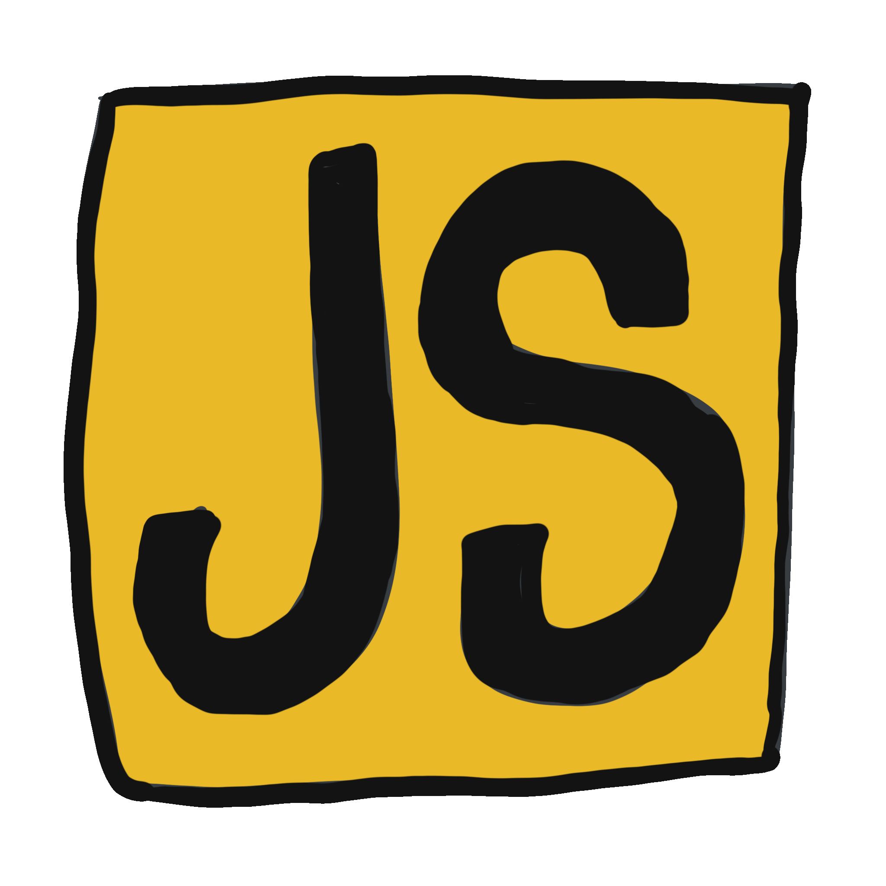

### Hi there ! </img>

<!--
**myungwoo-Y/myungwoo-Y** is a ✨ _special_ ✨ repository because its `README.md` (this file) appears on your GitHub profile.

Here are some ideas to get you started:

- 🔭 I’m currently working on ...
- 🌱 I’m currently learning ...
- 👯 I’m looking to collaborate on ...
- 🤔 I’m looking for help with ...
- 💬 Ask me about ...
- 📫 How to reach me: ...
- 😄 Pronouns: ...
- ⚡ Fun fact: ...
-->

I am a developer who is interested in React.js and Front-end. 😄

I like to develop many interesting things(So far, most have been developing web page using react.js) 
</img>

The main language is JavaScript, and other languages can be used at basic levels. 
</img>

